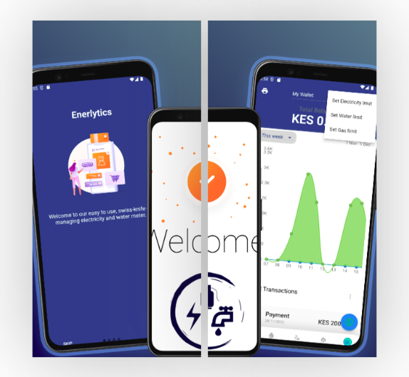
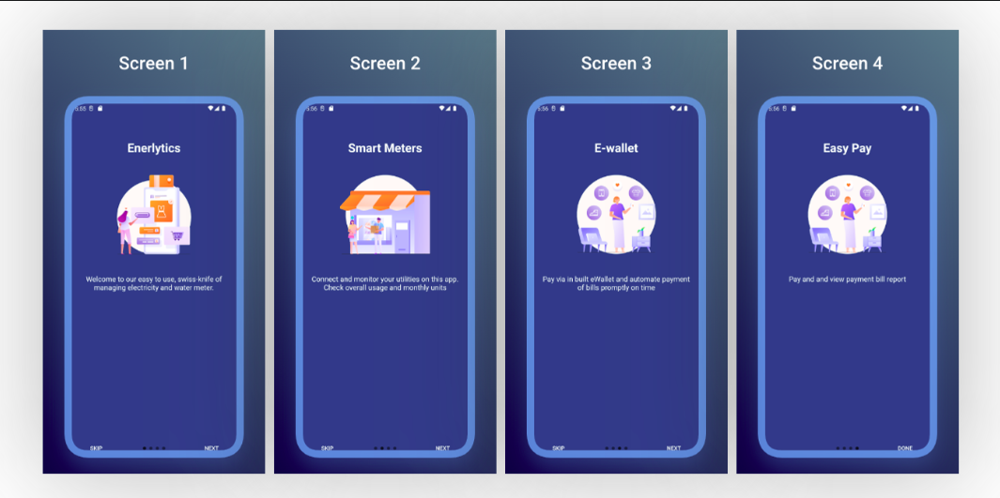
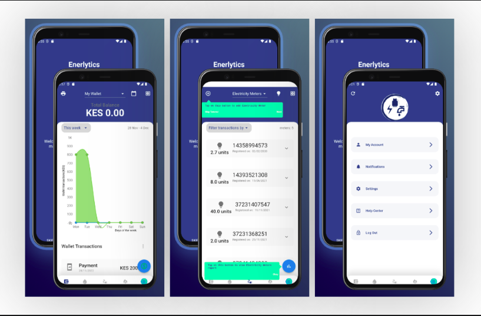

# Enerlytics Mobile User Manual

Enerlytics Mobile application is a convenient Android eWallet and utility meters monitoring app. It is designed to help users monitor and pay water, electricity and gas bills. The users must be connected to Enerlytics network and using Enerlytics Meter. 

# 	Introduction

*The requirement was to develop a cross-platform app that can be deployed on the major smart phone operating systems i.e Android, IOS and Windows. The app was also required to adapt to different form factors including tablet and phone size. In this perspective it should be responsive when users switch between landscape and portrait display mode. The mobile app is centered on user experience and was required to be friendly and intuitive by using modern frameworks and design patterns. In this documentation we will show the final conceived product and its full functionalities* 

#### Desirable key features

1. ##### Responsive and Adaptive to different Form-Factors

.png)

2. ##### Cross-Platform on major mobile operating Systems

The latest released version ensures quality by guaranteeing performance, scalability, security, maintainability, and reliability. 

## 			Functional Requirements

*Describe the purpose of the guide, which is typically to familiarize users with the important features and navigational elements of the tool.*

## 		Overview  	

*Explain in general terms the system and the purpose for which it is intended.  The description may include some of the following elements:* 

1. [On-boarding new Users](onboarding.md)

2. [Register new Users](register.md)
3. [Login user](login.md)
4. [Dashboard](dashboard.md)
5. [E-wallet](ewallet.md)
6. [Meter Management](meters_management.md)
7. [Meter Report](meter_report.md)
8. [Profile and Settings](profile_settings.md)
9. [Help and Support](help_support.md)
10. [System Design](system_design.md)
11. [Publishing to Playstore and Installation](installation.md)
12. [Maintenance and Updates](maintenace_updates.md)

## 		Project References

1. "Design and Implementation of an E-Wallet Mobile Application for Utility Bill Payment" by S. H. Park and J. H. Lee: This paper presents the design and implementation of an e-wallet mobile application for utility bill payment, including electricity, water, and gas bills.
2. "E-Wallet Mobile Application for Utility Bill Payment: A Review" by Y. J. Kim and J. H. Kim: This review paper discusses the use of e-wallet mobile applications for utility bill payment, including the benefits and challenges of using such applications for electricity, water, and gas bills.
3. "Mobile E-Wallet for Utility Bill Payment: A Survey" by K. S. Lee and H. J. Kim: This survey paper examines the use of mobile e-wallets for utility bill payment, including the features and functionality of such applications for paying electricity, water, and gas bills.
4. "E-Wallet Mobile Application for Utility Bill Payment: A Case Study" by J. H. Lee and J. H. Park: This case study discusses the implementation and use of an e-wallet mobile application for utility bill payment, including the experience of a specific user in paying their electricity, water, and gas bills using the application.

## 		Acronyms and Abbreviations

*Provide a list of the acronyms and abbreviations used in this document and the meaning of each.*

App - Mobile Application

APK - Android Package

