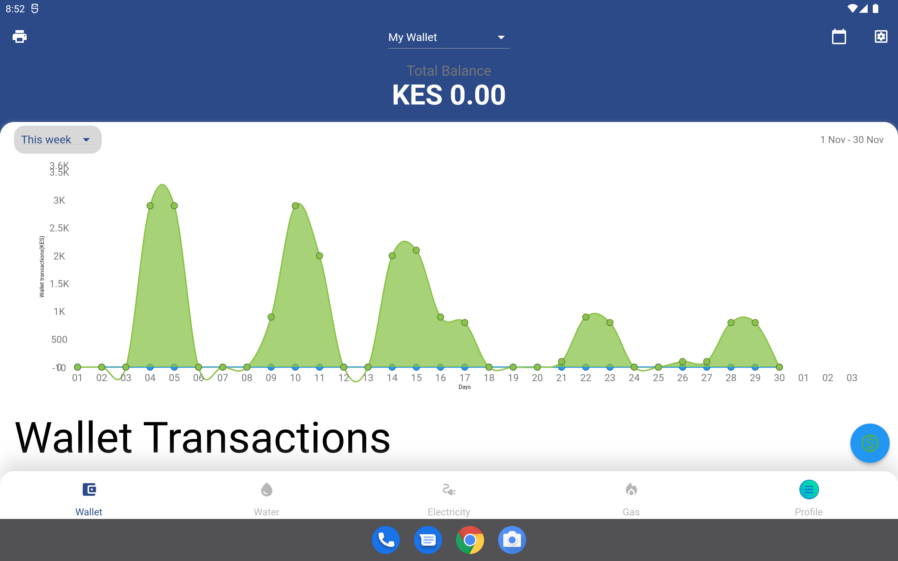

# Dashboard

Dashboard is the main part of app that is only accessible by authenticated users. App must establish a session to view dashboard.
It contains several screens that we will describe in details in next sections. These includes
1. E-wallet
2. Water Meters
3. Electricity meters
4. Gas meters
5. Meter Reports
6. Profile
7. Notifications
8. Settings

The dashboard was intuitively designed by placing components where user can access the easily. Dashboard has bottom navigation that is used to switch between E wallet, Water, Electricity Gas, and Profile screens.
This Each menu has a Icon and label to show the screen to open. The right floating button is noticeable and has quick action for each screen. Its placed right above the navigation button as if to complement navigation, has a distinct color to stand out and when clicked has wave ink visual indicator. The actions will be described in details in following sections. Another component common to the dashboard screens is the top header. 
Top header component is common in many apps and hence most likely the user will feel familiar with our layout. The left side of the header has drop down menu and in case the user device is wide most of the menu items will 
appear as icon placed in line. If the screen is smaller the menu item will be shown as a drop down. Each header has a title to show the name of the current open screen. On the right side of the top header, we place a button 
which perform different action for each screen. The function will be described in following sections.

|  |
| ------------------------------------------------------------ |

