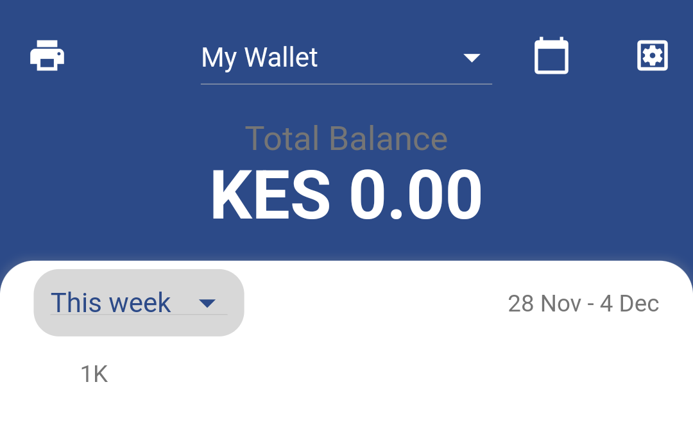
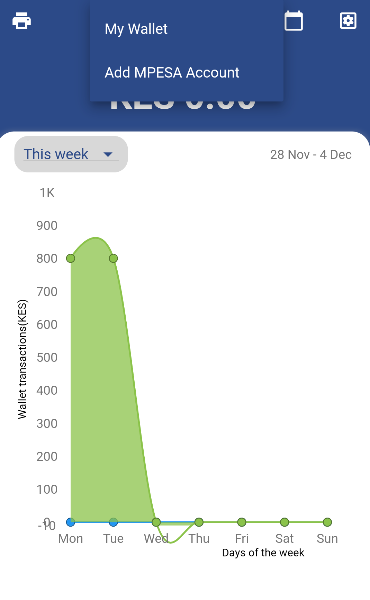
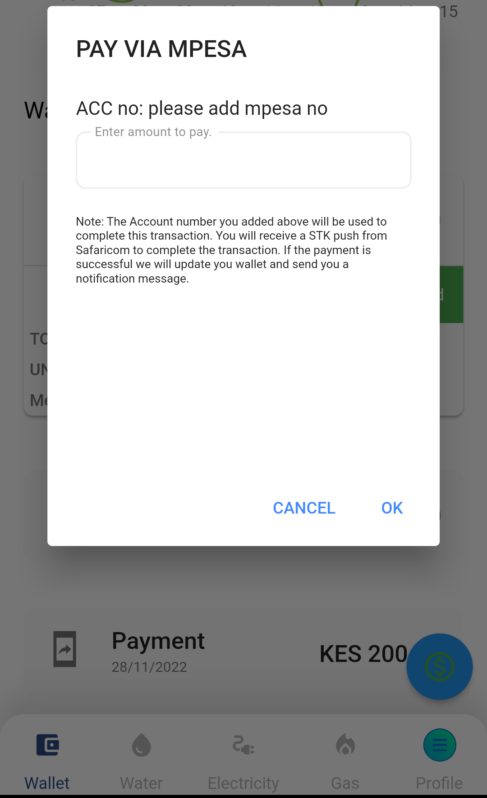
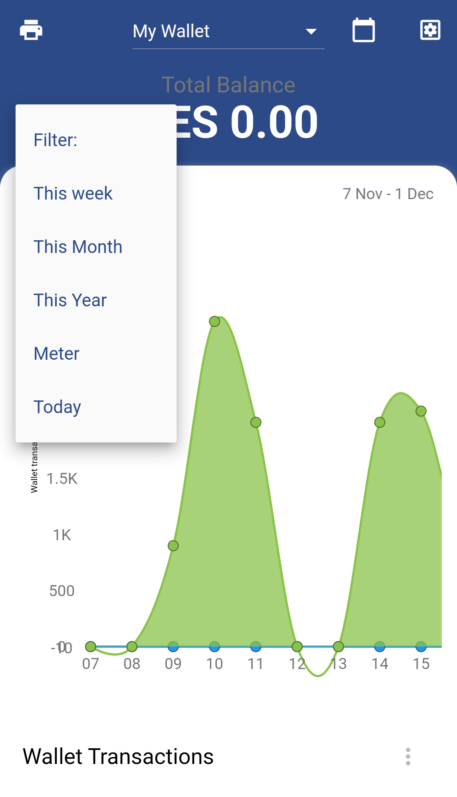
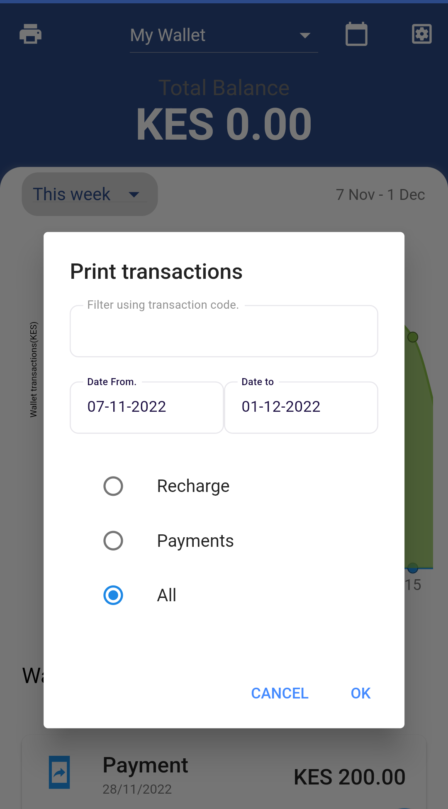
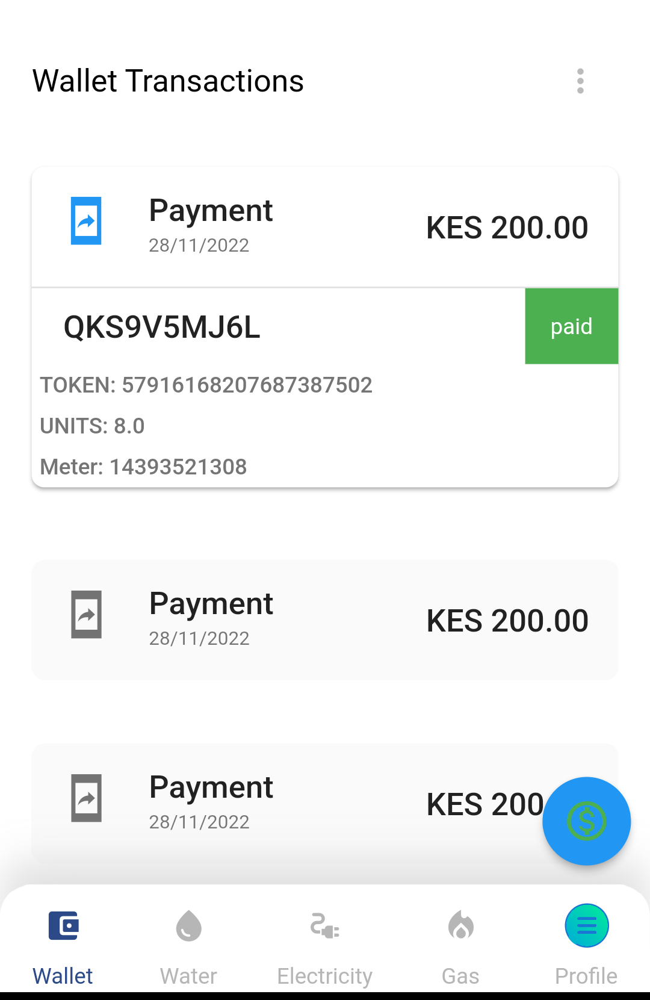

# E-Wallet

## E-Wallet

This screen is the home page in the dashboard. It contains the digital e wallet interface. The digital wallet is the financial transaction application that runs on mobile device. 
It allows securely stores payment information including the transaction can only be accessed in a session. 

This security features in this wallet includes 

1. Two factor authentication for new MPESA phone number, 
2. Biometric authentication,
3. Confirmation of transaction codes, 
4. Only logged users can view or print the transactions and 
5. Uses secure MPESA STK Push channel to recharge wallet.

### Benefits of using e wallet

1. Its ensure secure automated payment of bills. 
2. It does not require filing or memorizing utility providers account numbers. 
3. It eliminates the hassle of bill payments and paying them on time.  
4. It support payment to all utility providers.
5. Intuitively designed for easy use and access

#### Features of Wallet

1. Total balance - 

   |  |
   | :----------------------------------------------------------: |

   

2. Transaction Reports

   |  |
   | :----------------------------------------------------------: |

   

3. Action button to recharge

   |  |
   | :----------------------------------------------------------: |

   

4. Menu item button to filter transactions

   |  |
   | :----------------------------------------------------------: |

   

5. Print Button to export transactions

   |  |
   | :----------------------------------------------------------: |

   

6. List of transactions

   |  |
   | :----------------------------------------------------------: |

   

### Recharging e Wallet process 

Currently the process is not fully implemented