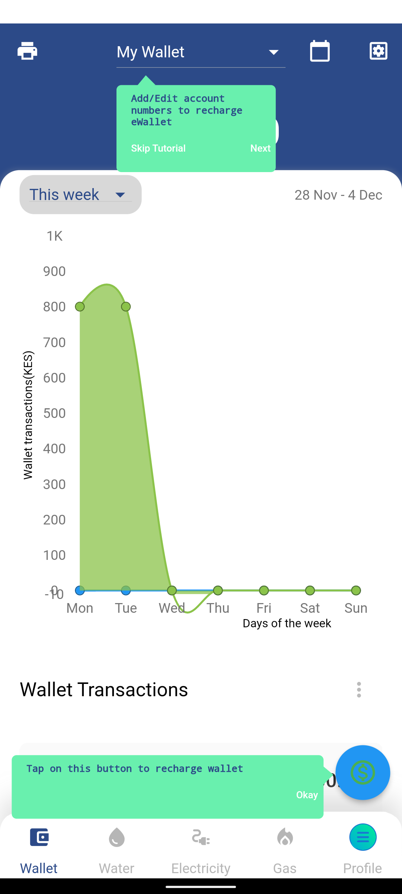
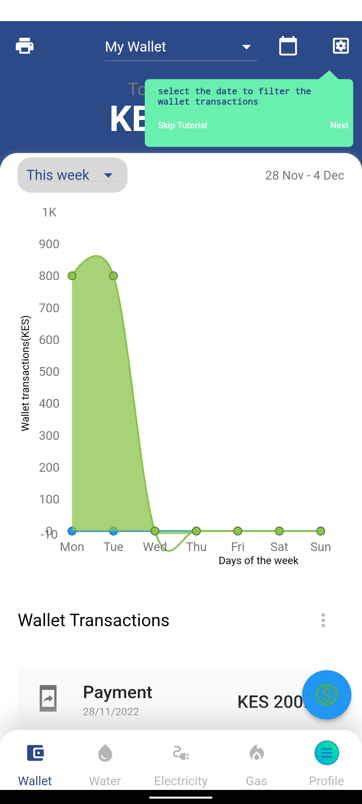
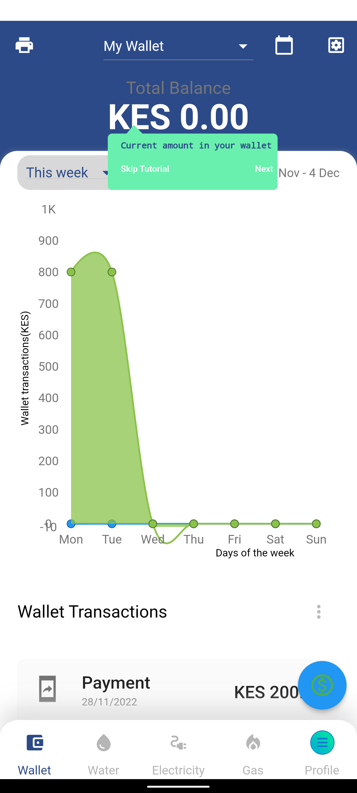
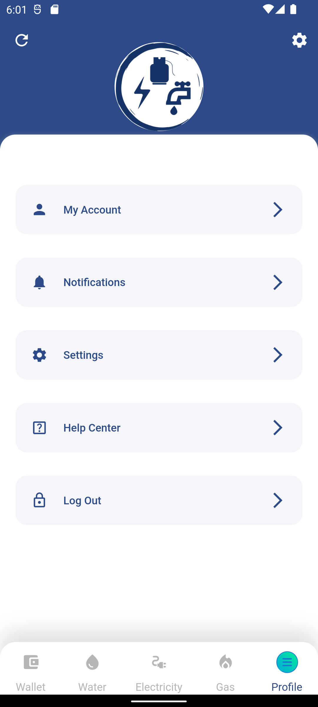
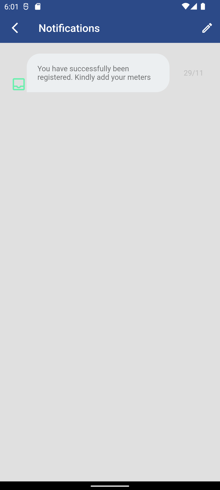
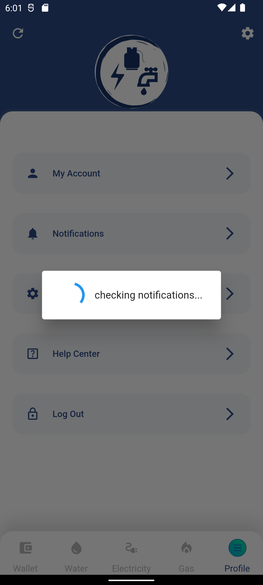

# Help and Support

### Mobile App Walkthrough

A mobile app walkthrough is a set of screens that provide guidance and information to users about how to use an app. It is often presented as a series of overlays or pop-ups within the app itself, and is designed to help users understand the app's features and functionality.

The purpose of a mobile app walkthrough is to help users quickly learn how to use an app, so that they can get the most value from it. Walkthroughs can be especially useful for complex apps with many features, or for users who are new to a particular app.

The enerlytics app has implemented this ways to explain to user the purpose and how to effectively use our app:

- Onboarding walkthroughs: These are designed to introduce users to an app and provide a high-level overview of its main features. Onboarding walkthroughs are usually presented when an app is first installed or opened, and they may include tips, tutorials, and other helpful information.

  |  |
  | ------------------------------------------------------------ |

  

- Interactive feature walkthroughs: These are walkthroughs that allow users to actively engage with an app as they progress through the tutorial. Interactive walkthroughs may include interactive elements such as buttons, sliders, or other controls that allow users to try out the app's features as they learn about them.

  |  |  |  |  |
  | ------------------------------------------------------------ | ------------------------------------------------------------ | ------------------------------------------------------------ | ------------------------------------------------------------ |

  

Mobile app walkthroughs can be an effective way to help users get started with an app, and they can be a valuable resource for users who have questions or need help using the app. Many apps also include in-app support or help centers, which provide additional information and resources for users who need assistance.

### Notifications

Cloud messaging is a service that allows apps to send notifications and messages to users' devices. These notifications can be used to alert users about new content or updates within the app, or to send important information such as updates or alerts. Users can typically customize their notification settings within the app or their device's settings menu. 

Enerlytics team will notify users on any issue regarding their profile, offer support and alert on new features.

|  |  |  |
| ------------------------------------------------------------ | ------------------------------------------------------------ | ------------------------------------------------------------ |

