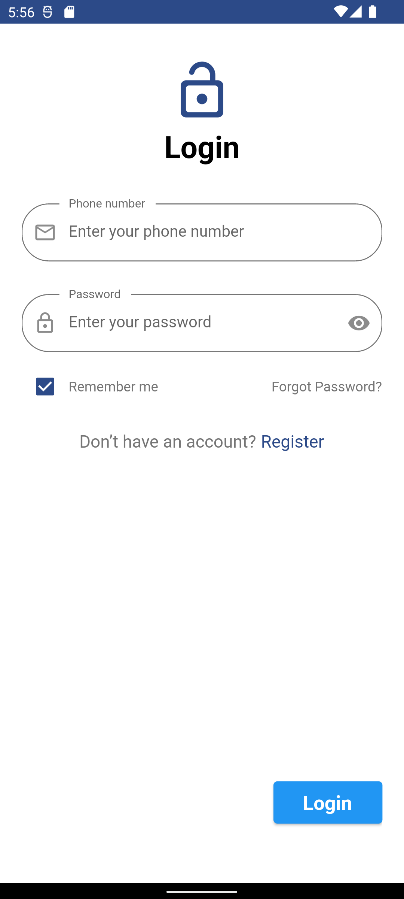
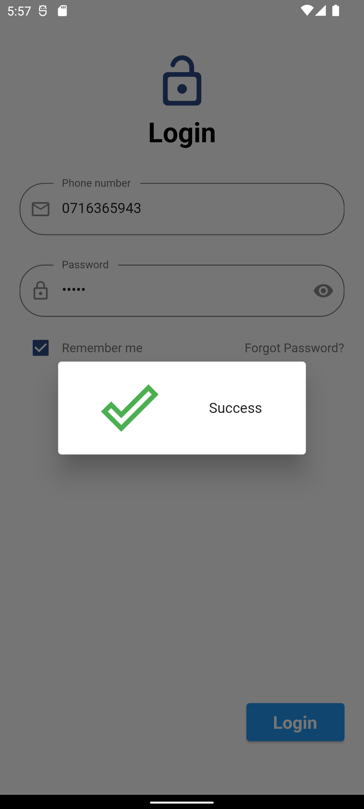
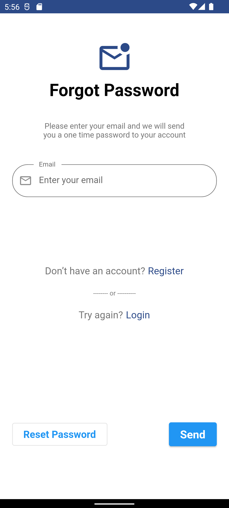
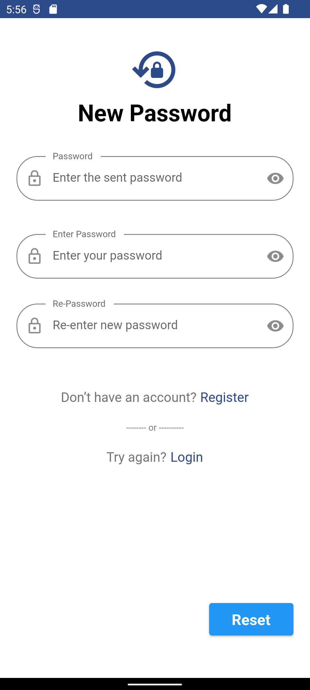
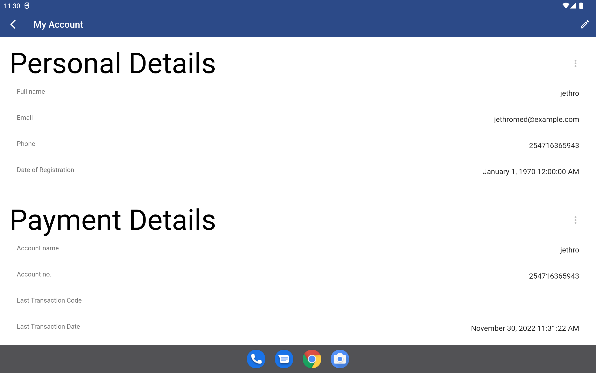

# User Login

### Login

This screen authenticates user using email/phone and password. This process is easy and requires user to input the two required fields. If any field is empty an error will be show the field to indicate its required.
In case user can not recall the password he/she can tap on forgot password link to redirect to reset password screen. You can automate the login
process by selecting remember me check box. It store the login credentials and anytime the the token expires, it automatically request a new one using the credentials saved. The process is safe and the credentials together with 
token and encrypted and securely stored on device. To clear them you can just logout. The login will not occur every time you login since the token live much longer.
The successful login is redirected to app home screen which is the main dashboard.

|  |  |
| ------------------------------------------------------------ | ------------------------------------------------------------ |

### Forgot/Reset Password

This screen helps when user has already registered successfully but they forgot their password. Its important feature of enerlytics to allow our esteemed users to change their
password and avoid getting locked out. To access this feature tap on forgot password link on the login screen or in the profile screen. It is a quick procedure and follow below steps:-

1. enter the email address that you used to register and tap on the send. This should show if message was sent in progress pop up.

2. Tap on reset Password button at the bottom. Copy the one time password sent to your email

3. On the Reset Password screen. Type the one time password and then enter a new password. This process should validates the password is similar to the one that was sent and the new password
    are similar. This opens a progress pop up that indicates if the reset password was successful.
    For a comprehensive detail on this process check system design data flow process. Check the possible error messages in case the authentication fails and how to fix them.
    After a successful resetting password, user is redirected to login.

  |  |  |
  | ------------------------------------------------------------ | ------------------------------------------------------------ |

  

### Profile Update

This screen display the user personal information collected during registration. The interface is easy to understand.  You can also view the date when registered.
The profile screen allow user to update their full names. In case user want to change phone number or email, user can tap on the change phone. 

The opt out option is link where user can delete their profile completely. If user tap on this link

|  |
| ------------------------------------------------------------ |

### Session

When a user is authenticated the app saves the authentication token and uses it to fetch subsequent API requests. That setup allows the app to only fetch data related to logged in user. This is what we refer as a session. 
The session initially fetches the user profile. The data is cached and stored intermittently as long as the user is logged in. 
The session also fetches user eWallet detail and displays on home page. The session also keep track of user meters and data related to past meter reading.
The session does not cache the e-wallet and meter data. Each time user needs to view the current state of the wallet and meter payment a request is sent to the server.
This ensure even if user is logged on a different app they are able to view same data. The app maintains a session using authenticated API requests.
The app does not connect or manage state with the meters. 
