# Enerlytics Mobile User Manual

Enerlytics Mobile application is a convenient Android eWallet and utility meters monitoring app. It is designed to help users monitor and pay water, electricity and gas bills. The users must be connected to Enerlytics network and using Enerlytics Meter. 

# 	Introduction

*The requirement was to develop a cross-platform app that can be deployed on the major smart phone operating systems i.e Android, IOS and Windows. The app was also required to adapt to different form factors including tablet and phone size. In this perspective it should be responsive when users switch between landscape and portrait display mode. The mobile app is centered on user experience and was required to be friendly and intuitive by using modern frameworks and design patterns. In this documentation we will show the final conceived product and its full functionalities* 

#### Desirable key features

1. ##### Responsive and Adaptive to different Form-Factors

.png)

2. ##### Cross-Platform on major mobile operating Systems

The latest released version ensures quality by guaranteeing performance, scalability, security, maintainability, and reliability. 

## 			Functional Requirements

*Describe the purpose of the guide, which is typically to familiarize users with the important features and navigational elements of the tool.*

## 		Overview  	

*Explain in general terms the system and the purpose for which it is intended.  The description may include some of the following elements:* 

1. [On-boarding new Users](onboarding.md)

2. [Register new Users](register.md)
3. [Login user](login.md)
4. [Dashboard](dashboard.md)
5. [E-wallet](ewallet.md)
6. [Meter Management](meters_management.md)
7. [Meter Report](meter_report.md)
8. [Profile and Settings](profile_settings.md)
9. [Help and Support](help_support.md)
10. [System Design](system_design.md)
11. [Publishing to Playstore and Installation](installation.md)
12. [Maintenance and Updates](maintenace_updates.md)

## 		Project References

1. "Design and Implementation of an E-Wallet Mobile Application for Utility Bill Payment" by S. H. Park and J. H. Lee: This paper presents the design and implementation of an e-wallet mobile application for utility bill payment, including electricity, water, and gas bills.
2. "E-Wallet Mobile Application for Utility Bill Payment: A Review" by Y. J. Kim and J. H. Kim: This review paper discusses the use of e-wallet mobile applications for utility bill payment, including the benefits and challenges of using such applications for electricity, water, and gas bills.
3. "Mobile E-Wallet for Utility Bill Payment: A Survey" by K. S. Lee and H. J. Kim: This survey paper examines the use of mobile e-wallets for utility bill payment, including the features and functionality of such applications for paying electricity, water, and gas bills.
4. "E-Wallet Mobile Application for Utility Bill Payment: A Case Study" by J. H. Lee and J. H. Park: This case study discusses the implementation and use of an e-wallet mobile application for utility bill payment, including the experience of a specific user in paying their electricity, water, and gas bills using the application.

## 		Acronyms and Abbreviations

*Provide a list of the acronyms and abbreviations used in this document and the meaning of each.*

App - Mobile Application

APK - Android Package

eWallet - 

API - 

## On-boarding Users

The first welcome screen is the on-boarding screens. This the main entry to enerlytics app for new users. It is displayed on each first or new install. 
It describes the main features of the app, using a graphic image and text description below the image. This serves the purpose of brief introduction that should 
guide the user step by step to welcome the user. 

|  |
| ------------------------------------------------------------ |

There are two buttons at the bottom of the on-boarding screens that are meant for navigation.
The left button when tapped allows the user to skip the orientation and leads the user to the last on-board screen. It was 
added for quick navigation if user has already been oriented. The last on-board screen has a single button containing text done 
to finalize the on-boarding and  direct user to register screen. The Other screen have a right button that navigates the user 
forward along the four screens. The content in these screens is self explanatory and are designed to catch user attention.
The images and text content is static and is contained in the executable application. The content can only be changed in a new app version.

## Welcome page

The welcome page serves as the splash page. It shows every time a user loads the app. The welcome page is entry screen for 
users who have been authenticated. It was designed to show the app logo, welcome message with name of the logged in user, and 
biometric widget. The main purpose of welcome screen is to authenticate previously logged in user by requesting and refreshing authentication 
token. This token is encrypted and securely stored for any subsequent API request. Only authentic token can communicate to the server
to exchange data. The welcome page allows the user to lock the app using biometric fingerprint and ensure only data privacy.
This screen is essential as it acts as the gate keeper to establish an authentic session before using the app. User can decide if the can enable or disable biometric authentication in the settings. This screen cannot be customized by user but it has feedback message
to alert user on the background processes. To learn more about check the system design page.

| 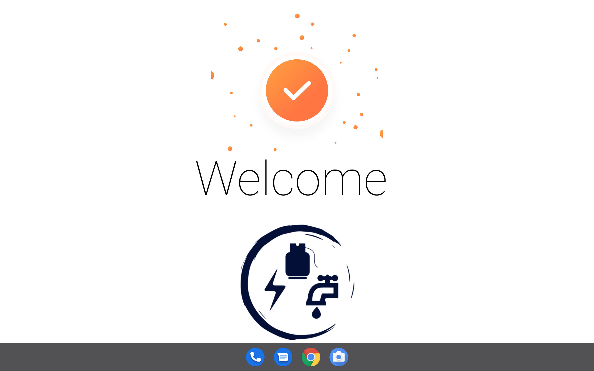 |
| -------------------------------------------------- |

# User Register

### Register Screen

The process of converting anonymous user who have just installed our enerlytics app happens on this screen. It is crucial 
for the app functionality otherwise anonymous can not operate the app without registering and creating a profile. The process only requires minimal data to get started. 

| 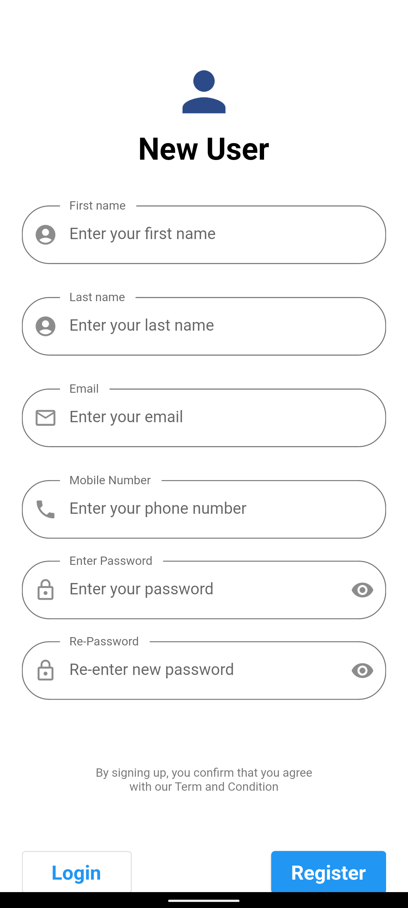 |
| ------------------------------------------------------------ |

User provides their full names; first and last name, email address, mobile phone number,
and a unique password. All these data is required to be able to submit registration form. In case any is omitted an error and
prompt message is show below the form to indicate the value is required. The password should be a minimum of 5 characters and can contain
alphanumeric and special characters. The user is requested to type both fields password field to ensure user can remember the password 
during the login process. At the end of each password field, user can toggle the visibility of the password. This helps the user to read
the typed content to confirm both password are similar. When user finishes entering the data in all the fields, users are provide a disclaimer
to read the term and conditions. This is important since it describes our commitment to ensure user privacy for any personal data provided.
The full content of terms and condition can be read on this link. After reading the whole document user is expected to agree to the term
and conditions. However its worth noting the agreement is not a strict requirement to submit the registration form. The user can now tap
on the registration submit button. This start a background process which validates and submits the data to the server. Its worth noting Internet connection is required 
for this process.  A pop up progress bar is shown to indicate the connection and the message returned from the server. If the registration is successful user can proceed 
to the Phone/Email authentication page. Check the possible error messages in case the registration fails and how to fix them.

|  |  |  |
| ------------------------------------------------------------ | ------------------------------------------------------------ | ------------------------------------------------------------ |

### Two-factor Code Authentication Screen

This screen authenticates phone number and email they have registered are valid. This is commonly referred as two factor authentication. 
It allows the enerlytics team forward important message via email and SMS. In case the user didn't receive a message a link below the code field that allows the user to
resend the code. The process of code authentication can be skipped if the user taps on login button. This is does not escape the authentication but reduces the registration process for a user in a hurry.
In case user entered wrong data in either email or phone, a profile update is 
show below the resend code link. Check the system design to learn more about the code authentication process. This process also requires an Internet connection.
Check the possible error messages in case the authentication fails and how to fix them. When the code is successfully authenticated, user can proceed to login

|  |  |  |
| ------------------------------------------------------------ | ------------------------------------------------------------ | ------------------------------------------------------------ |

# User Login

### Login

This screen authenticates user using email/phone and password. This process is easy and requires user to input the two required fields. If any field is empty an error will be show the field to indicate its required.
In case user can not recall the password he/she can tap on forgot password link to redirect to reset password screen. You can automate the login
process by selecting remember me check box. It store the login credentials and anytime the the token expires, it automatically request a new one using the credentials saved. The process is safe and the credentials together with 
token and encrypted and securely stored on device. To clear them you can just logout. The login will not occur every time you login since the token live much longer.
The successful login is redirected to app home screen which is the main dashboard.

| 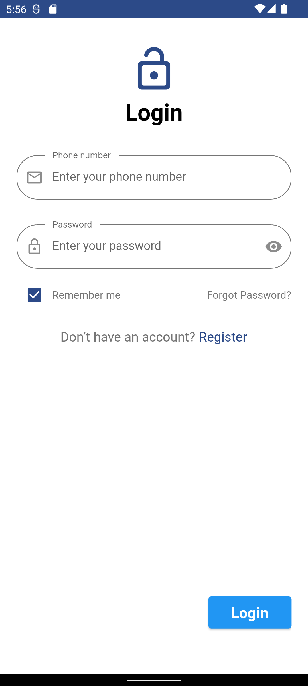 |  |
| ------------------------------------------------------------ | ------------------------------------------------------------ |

### Forgot/Reset Password

This screen helps when user has already registered successfully but they forgot their password. Its important feature of enerlytics to allow our esteemed users to change their
password and avoid getting locked out. To access this feature tap on forgot password link on the login screen or in the profile screen. It is a quick procedure and follow below steps:-

1. enter the email address that you used to register and tap on the send. This should show if message was sent in progress pop up.

2. Tap on reset Password button at the bottom. Copy the one time password sent to your email

3. On the Reset Password screen. Type the one time password and then enter a new password. This process should validates the password is similar to the one that was sent and the new password
   are similar. This opens a progress pop up that indicates if the reset password was successful.
   For a comprehensive detail on this process check system design data flow process. Check the possible error messages in case the authentication fails and how to fix them.
   After a successful resetting password, user is redirected to login.

|  |  |
| ------------------------------------------------------------ | ------------------------------------------------------------ |

  

### Profile Update

This screen display the user personal information collected during registration. The interface is easy to understand.  You can also view the date when registered.
The profile screen allow user to update their full names. In case user want to change phone number or email, user can tap on the change phone. 

The opt out option is link where user can delete their profile completely. If user tap on this link

|  |
| ------------------------------------------------------------ |

### Session

When a user is authenticated the app saves the authentication token and uses it to fetch subsequent API requests. That setup allows the app to only fetch data related to logged in user. This is what we refer as a session. 
The session initially fetches the user profile. The data is cached and stored intermittently as long as the user is logged in. 
The session also fetches user eWallet detail and displays on home page. The session also keep track of user meters and data related to past meter reading.
The session does not cache the e-wallet and meter data. Each time user needs to view the current state of the wallet and meter payment a request is sent to the server.
This ensure even if user is logged on a different app they are able to view same data. The app maintains a session using authenticated API requests.
The app does not connect or manage state with the meters. 

# Dashboard

Dashboard is the main part of app that is only accessible by authenticated users. App must establish a session to view dashboard.
It contains several screens that we will describe in details in next sections. These includes

1. E-wallet
2. Water Meters
3. Electricity meters
4. Gas meters
5. Meter Reports
6. Profile
7. Notifications
8. Settings

The dashboard was intuitively designed by placing components where user can access the easily. Dashboard has bottom navigation that is used to switch between E wallet, Water, Electricity Gas, and Profile screens.
This Each menu has a Icon and label to show the screen to open. The right floating button is noticeable and has quick action for each screen. Its placed right above the navigation button as if to complement navigation, has a distinct color to stand out and when clicked has wave ink visual indicator. The actions will be described in details in following sections. Another component common to the dashboard screens is the top header. 
Top header component is common in many apps and hence most likely the user will feel familiar with our layout. The left side of the header has drop down menu and in case the user device is wide most of the menu items will 
appear as icon placed in line. If the screen is smaller the menu item will be shown as a drop down. Each header has a title to show the name of the current open screen. On the right side of the top header, we place a button 
which perform different action for each screen. The function will be described in following sections.

| 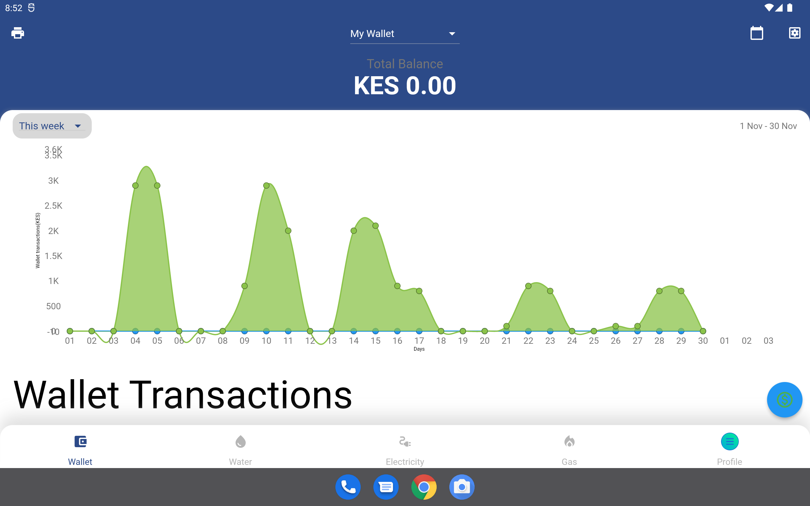 |
| ------------------------------------------------------------ |

# E-Wallet

## E-Wallet

This screen is the home page in the dashboard. It contains the digital e wallet interface. The digital wallet is the financial transaction application that runs on mobile device. 
It allows securely stores payment information including the transaction can only be accessed in a session. 

This security features in this wallet includes 

1. Two factor authentication for new MPESA phone number, 
2. Biometric authentication,
3. Confirmation of transaction codes, 
4. Only logged users can view or print the transactions and 
5. Uses secure MPESA STK Push channel to recharge wallet.

### Benefits of using e wallet

1. Its ensure secure automated payment of bills. 
2. It does not require filing or memorizing utility providers account numbers. 
3. It eliminates the hassle of bill payments and paying them on time.  
4. It support payment to all utility providers.
5. Intuitively designed for easy use and access

#### Features of Wallet

1. Total balance - 

   |  |
   | :----------------------------------------------------------: |

   

2. Transaction Reports

   |  |
   | :----------------------------------------------------------: |

   

3. Action button to recharge

   |  |
   | :----------------------------------------------------------: |

   

4. Menu item button to filter transactions

   |  |
   | :----------------------------------------------------------: |

   

5. Print Button to export transactions

   |  |
   | :----------------------------------------------------------: |

   

6. List of transactions

   | 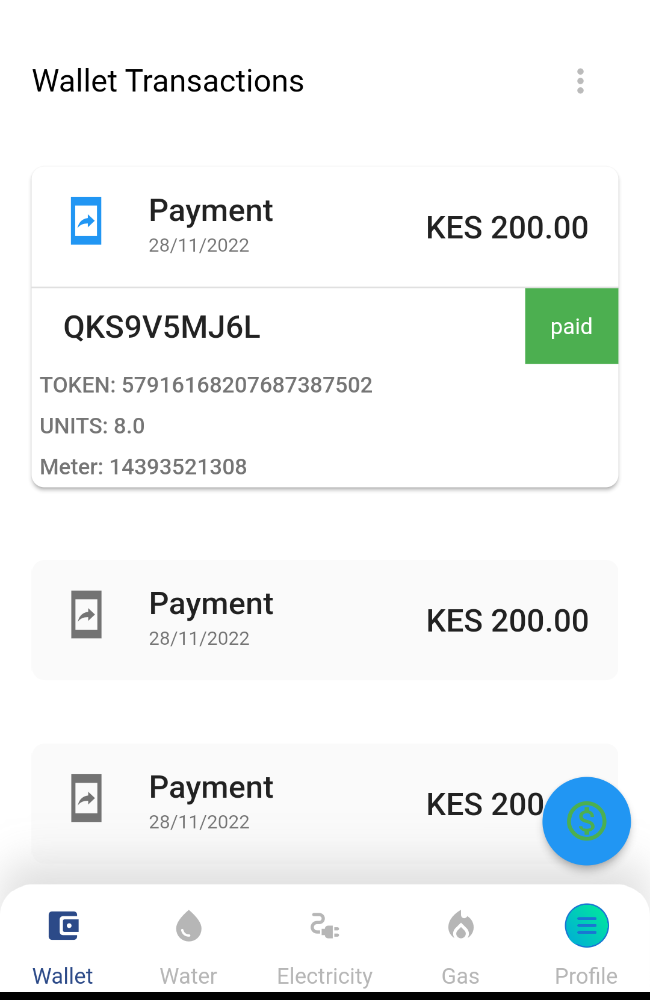 |
   | :----------------------------------------------------------: |

   

### Recharging e Wallet process 

Currently the process is not fully implemented

# Meter Management

## Meters

In the subsequent 3 screens we have Water, Electricity and Gas Meters. You can navigate between these screens using the bottom screen navigation. We will describe all the screens since their functionality is similar and easy to to use it.
The screens are used to track each utility as the name suggests. User can add new meter to track and the meters are listed on each screen. The listed meters are held in expandable component that show a recent bill payment transaction only related to the expanded meter.
User can also view on the reports for the meters added.

### Features of meters

1. Register a meter
2. Refresh Meter
3. Show Readings History
4. Filter Meters
5. Show Report

## Register Meter

This screen enable user to register their utility meter using Meter Number and the last MPESA transaction code. This setup assumes the user has been issued with our meters and its active and working. The Meter Number is unique for each Meter. 

|  |
| :----------------------------------------------------------: |

Tap on the button at the top header the one on left side. This action open a form with two input fields to fill in. 

Enter the meter number and the last MPESA transaction code used to pay or recharge the meter.

Tap on the `Register` button and a request will be sent to Enerlytics servers to verify the input. If the Meter No matches any of our registered meters and we can check the MPESA transaction code is correct we can confirm you own and operates the meter. Meter will be added to you profile and no one else can monitor this meter. You will now be able to track the meter.

In case any of the input information is invalid user will receive a response error message indicating why the registration failed. You can rectify any error and in case the error persist you can contact us for further assistance.

| 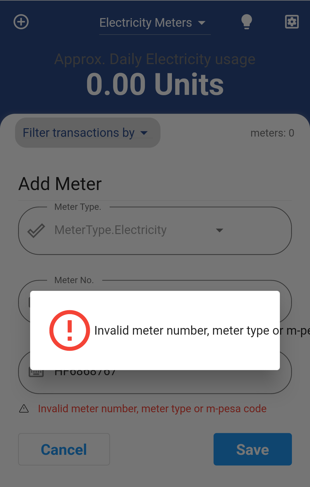 |
| :----------------------------------------------------------: |

Registered meters are not shared with other users. You can monitor the meter on many devices you have logged in with your account credentials.

## Refresh Meters

The App automatically fetches the meters owned by the logged in users. When user registers  a new Meter the new meter and its transaction history are loaded from server and displayed on the list of meters. In case the user wish to manually refresh the meters, you can tap on the refresh icon button on the right side of the header. This can be effective is users switches the Internet connection or if they notice the data is stale. User can also refresh or fetch more data transactions history of a meter by expanding the specific meter widget then scroll through the listed transaction. To fetch more tap on more link and the data more will be fetched. 

| 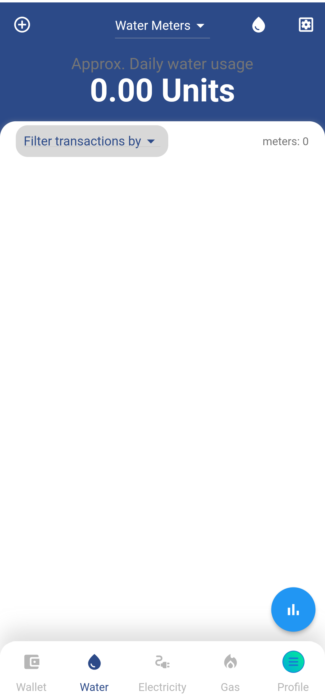 |  |
| :----------------------------------------------------------: | :----------------------------------------------------------: |

## Displaying Readings

The vital reading to monitor include:- Current Meter reading, Previous Meter reading and average meter usage. 

| 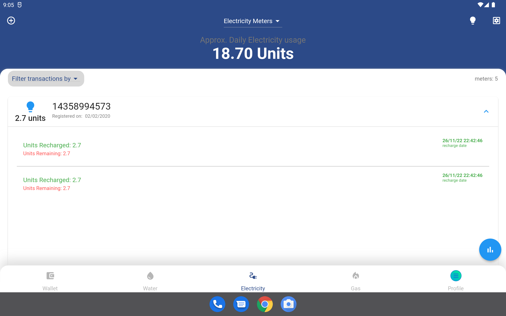 |
| :----------------------------------------------------------: |

#### Definition and Calculations

##### Current Reading 

This the amount of units last amount recharged for the meter. It is displayed on the meter widget. It is easy to see for each meter listed. It also includes the  date it was recharged.

##### Previous Reading 

This are a list recharges overtime arranged in descending order. The previous reading are shown when you expand the meter widget by tapping on the right expand icon button. It shows a list of recharges and the date it was recharged.

##### Average Reading 

This is the estimated household consumption per day. The  average meter reading is shown at the top header. User can filter using meter to check the average reading of a specific meter or a combination of meters.

## Filter Meter Readings

The user can track transactions even those made before the meter was registered. It allows filtering these transaction by date range, days of the week, weeks of a month, or each month in an year. This is effective to check overall usage and monitor previous readings. To filter just select the drop down menu below the top header on the left side. Pick any filtering option and data will be refreshed automatically. You can also select specific dates to fetch by using date picker at the top header, right side.

|  |
| :----------------------------------------------------------: |

# Meter Report

The enerlytics app shows three meter reports, each for every Meter Type; Electricity, Water and Gas meter. On each Meter type interface you can access the meter report by tapping on the floating blue button at the bottom right. It opens up a screen that show a several charts which displays different analysis of the utility bills. 

The key note is that all charts show the summed up or averages of the payment history for all the selected meters. It also show the transactions for only the selected period. To filter correctly use the filtering widgets accordingly to observe the specific meters and time period.

The main features in this screen includes:-

1. Total units Segmented Pie chart, average usage and current usage
2. Filter drop down
3. Usage Progress chart - Total Units consumed compared to target limit
4. Usage Progress chart - Total amount spent compared to target limit
5. Meter Reading Bar chart - Daily units recharged showing leakages and set limits

## 1. Total Units Segmented Pie Chart

This graph show the percent unit consumed by each meter. Each meter is color coded uniquely and assigned meter label that has prefix m, followed by number. You can change the number of meters shown by using the selected meter in the drop down filter.

On the left and right sides of the this pie chart, we have circled values that shows the current units used and the approximate average units respectively. 

| 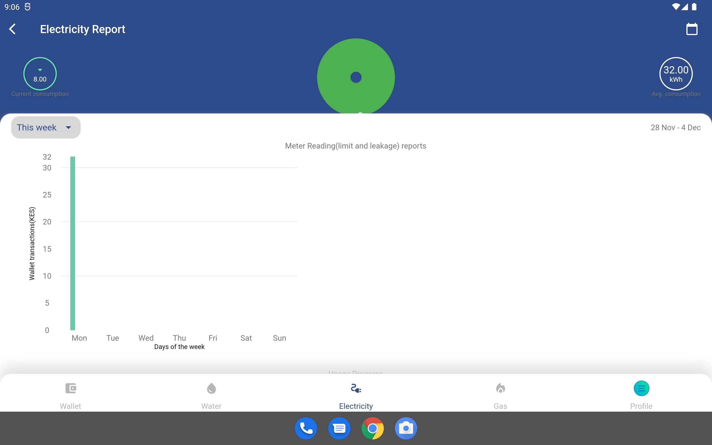 |
| ------------------------------------------------------------ |

2. ## Filter drop down

The user can refresh the chart values even those made before the meter was registered. Using the drop down feature, you can select between filtering by time range and meter number. It allows filtering these transaction by date range, days of the week, weeks of a month, or each month in an year. This is effective to check overall usage and monitor previous readings. To filter just select the drop down menu below the top header on the left side. Pick any filtering option and data will be refreshed automatically. You can also select specific dates to fetch by using date picker at the top header, right side.

|  |
| ------------------------------------------------------------ |

3. ## Usage Progress chart 

The usage progress charts displays the current units usage and current amount usage against the limit set by the user. The limit is set on each Meter Type interface and the stored in the app. This value is compared with the current units used and a  graph is shown as a progress value. The values are total of the selected meters and the value can be adjusted using filters. The purpose of the usage progress chart is to provide the user with a clear and visual representation of their utility usage so that they can better understand their consumption habits and make informed decisions about how to conserve resources and manage their utility costs.

|  |
| ------------------------------------------------------------ |

4. ## Meter Reading Bar chart

The chart typically consists of a series of bars, with each bar representing the usage for a specific day, week, or month.

The barchart may also include markers or indicators to show certain events or conditions that may have affected the usage. For example, a limit marker may indicate the maximum amount of usage allowed under a certain plan or rate, while a leakage marker may indicate a problem with a plumbing or gas line that is causing an abnormal amount of usage.

In addition to these markers, the utility bill meter bar chart may also include other information such as the cost of the usage, the gas water and electricity. This information can help consumers understand their energy usage and identify opportunities to reduce their energy costs by making changes to their consumption habits or finding more cost-effective rate plans.

In the current version there's no way to collect leakage information and thus calculation is done with assumption leakages are zero.

|  |
| ------------------------------------------------------------ |

# Profile and Settings 

Eneryltics mobile app settings interface allows you to customize various aspects of the app's behavior and appearance. Some common features that may be included in a mobile app settings interface include:

1. Personalization options: These options allow users to customize the app to their preferences, such as selecting a preferred language or theme.
2. Notification settings: Users can specify whether they want to receive notifications from the app and how those notifications should be delivered (e.g. via push notification or email).
3. Privacy settings: Users may be able to adjust privacy settings to control who can see their data and how it is used.
4. Account settings: Users can manage their account settings, such as changing their password or adding/removing payment methods.
5. Data usage: Users may be able to view and manage their data usage within the app, including options to limit data usage or turn off data usage altogether.
6. Help and support: Some app settings interfaces may include a section with links to help resources or a way to contact the app's support team.
7. App permissions: Users may be able to view and manage the permissions that the app has been granted, such as access to the device's camera or location data.
8. Uninstall/delete: Users may be able to uninstall or delete the app from their device through the settings interface.

|  |  |  |
| ------------------------------------------------------------ | ------------------------------------------------------------ | ------------------------------------------------------------ |

# Help and Support

### Mobile App Walkthrough

A mobile app walkthrough is a set of screens that provide guidance and information to users about how to use an app. It is often presented as a series of overlays or pop-ups within the app itself, and is designed to help users understand the app's features and functionality.

The purpose of a mobile app walkthrough is to help users quickly learn how to use an app, so that they can get the most value from it. Walkthroughs can be especially useful for complex apps with many features, or for users who are new to a particular app.

The enerlytics app has implemented this ways to explain to user the purpose and how to effectively use our app:

- Onboarding walkthroughs: These are designed to introduce users to an app and provide a high-level overview of its main features. Onboarding walkthroughs are usually presented when an app is first installed or opened, and they may include tips, tutorials, and other helpful information.

  |  |
  | ------------------------------------------------------------ |

  

- Interactive feature walkthroughs: These are walkthroughs that allow users to actively engage with an app as they progress through the tutorial. Interactive walkthroughs may include interactive elements such as buttons, sliders, or other controls that allow users to try out the app's features as they learn about them.

  | 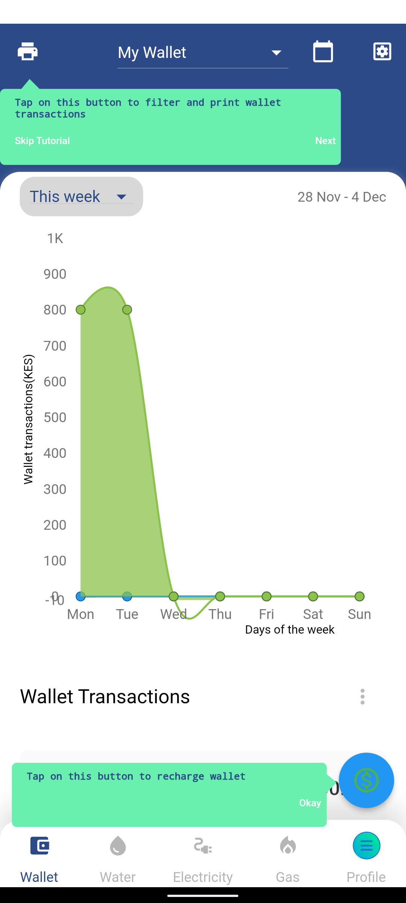 |  | 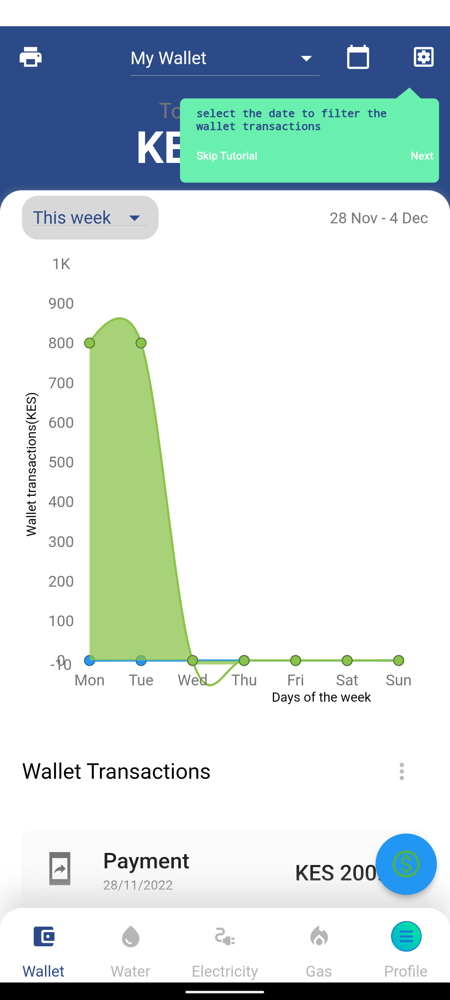 |  |
  | ------------------------------------------------------------ | ------------------------------------------------------------ | ------------------------------------------------------------ | ------------------------------------------------------------ |

  

Mobile app walkthroughs can be an effective way to help users get started with an app, and they can be a valuable resource for users who have questions or need help using the app. Many apps also include in-app support or help centers, which provide additional information and resources for users who need assistance.

### Notifications

Cloud messaging is a service that allows apps to send notifications and messages to users' devices. These notifications can be used to alert users about new content or updates within the app, or to send important information such as updates or alerts. Users can typically customize their notification settings within the app or their device's settings menu. 

Enerlytics team will notify users on any issue regarding their profile, offer support and alert on new features.

|  | 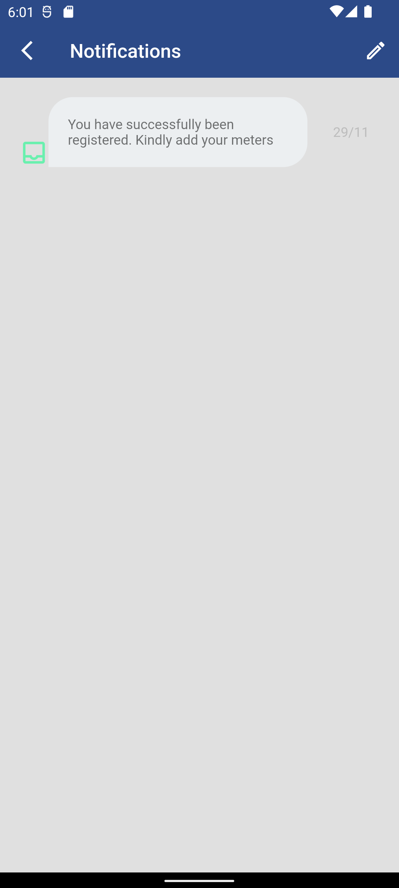 |  |
| ------------------------------------------------------------ | ------------------------------------------------------------ | ------------------------------------------------------------ |

