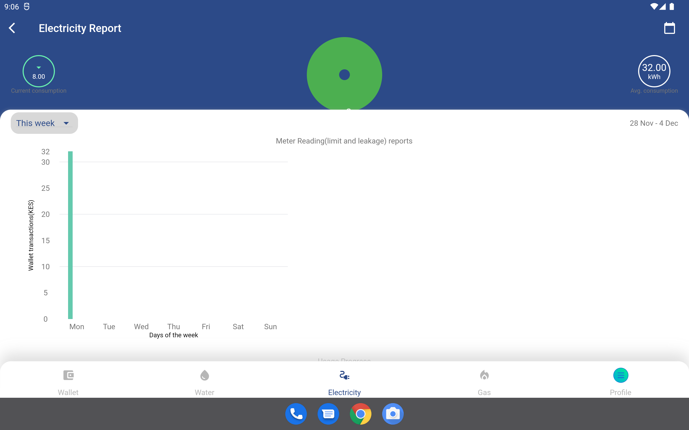
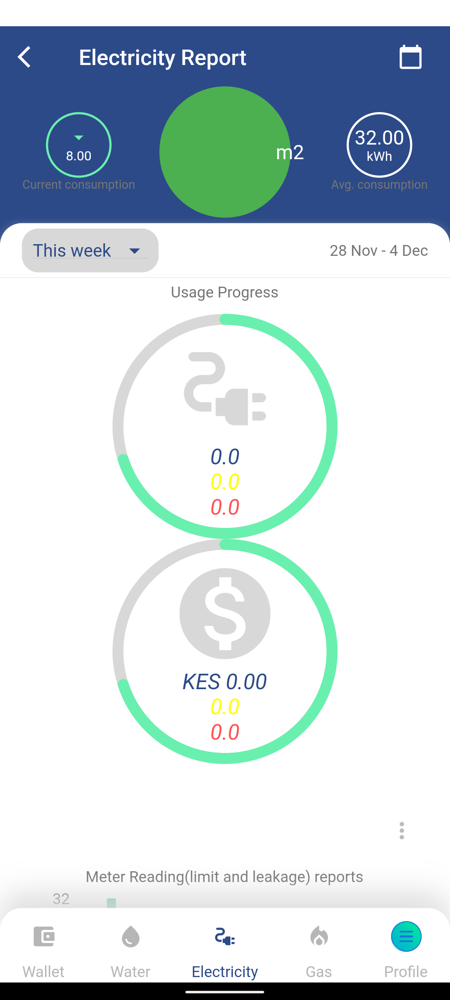

# Meter Report

The enerlytics app shows three meter reports, each for every Meter Type; Electricity, Water and Gas meter. On each Meter type interface you can access the meter report by tapping on the floating blue button at the bottom right. It opens up a screen that show a several charts which displays different analysis of the utility bills. 

The key note is that all charts show the summed up or averages of the payment history for all the selected meters. It also show the transactions for only the selected period. To filter correctly use the filtering widgets accordingly to observe the specific meters and time period.

The main features in this screen includes:-

1. Total units Segmented Pie chart, average usage and current usage
2. Filter drop down
3. Usage Progress chart - Total Units consumed compared to target limit
4. Usage Progress chart - Total amount spent compared to target limit
5. Meter Reading Bar chart - Daily units recharged showing leakages and set limits

## 1. Total Units Segmented Pie Chart

This graph show the percent unit consumed by each meter. Each meter is color coded uniquely and assigned meter label that has prefix m, followed by number. You can change the number of meters shown by using the selected meter in the drop down filter.

On the left and right sides of the this pie chart, we have circled values that shows the current units used and the approximate average units respectively. 

|  |
| ------------------------------------------------------------ |

2. ## Filter drop down

The user can refresh the chart values even those made before the meter was registered. Using the drop down feature, you can select between filtering by time range and meter number. It allows filtering these transaction by date range, days of the week, weeks of a month, or each month in an year. This is effective to check overall usage and monitor previous readings. To filter just select the drop down menu below the top header on the left side. Pick any filtering option and data will be refreshed automatically. You can also select specific dates to fetch by using date picker at the top header, right side.

|  |
| ------------------------------------------------------------ |

3. ## Usage Progress chart 

The usage progress charts displays the current units usage and current amount usage against the limit set by the user. The limit is set on each Meter Type interface and the stored in the app. This value is compared with the current units used and a  graph is shown as a progress value. The values are total of the selected meters and the value can be adjusted using filters. The purpose of the usage progress chart is to provide the user with a clear and visual representation of their utility usage so that they can better understand their consumption habits and make informed decisions about how to conserve resources and manage their utility costs.

|  |
| ------------------------------------------------------------ |

4. ## Meter Reading Bar chart

The chart typically consists of a series of bars, with each bar representing the usage for a specific day, week, or month.

The barchart may also include markers or indicators to show certain events or conditions that may have affected the usage. For example, a limit marker may indicate the maximum amount of usage allowed under a certain plan or rate, while a leakage marker may indicate a problem with a plumbing or gas line that is causing an abnormal amount of usage.

In addition to these markers, the utility bill meter bar chart may also include other information such as the cost of the usage, the gas water and electricity. This information can help consumers understand their energy usage and identify opportunities to reduce their energy costs by making changes to their consumption habits or finding more cost-effective rate plans.

In the current version there's no way to collect leakage information and thus calculation is done with assumption leakages are zero.

|  |
| ------------------------------------------------------------ |

