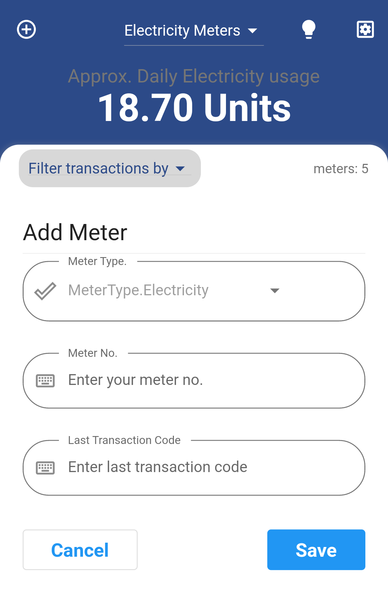
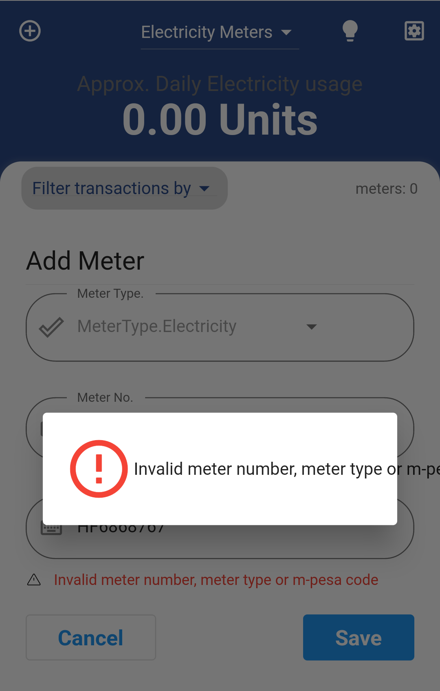
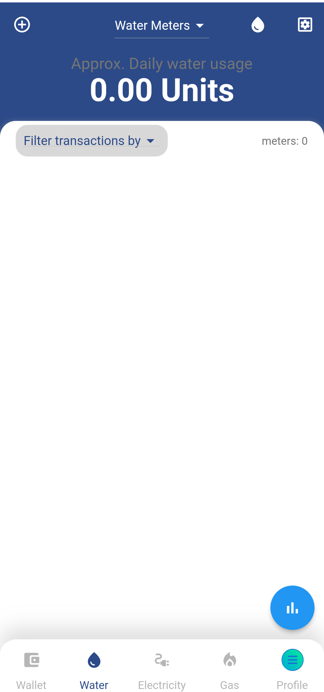
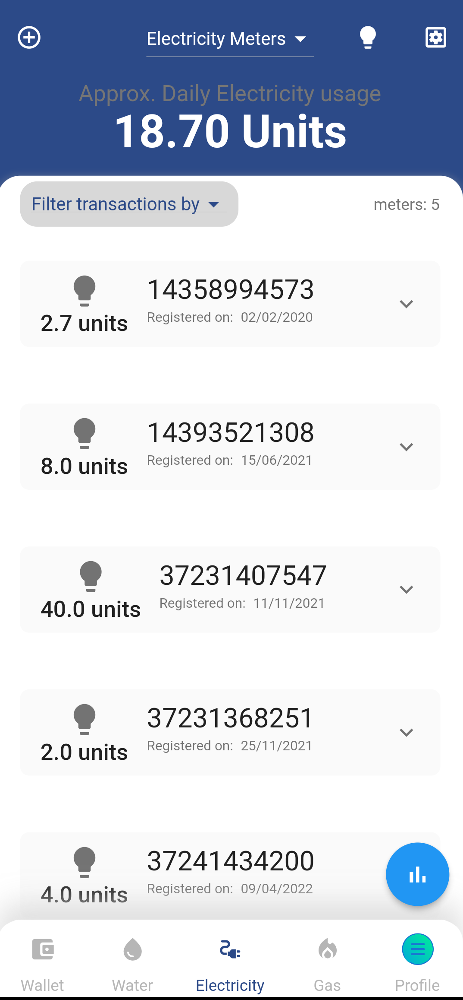
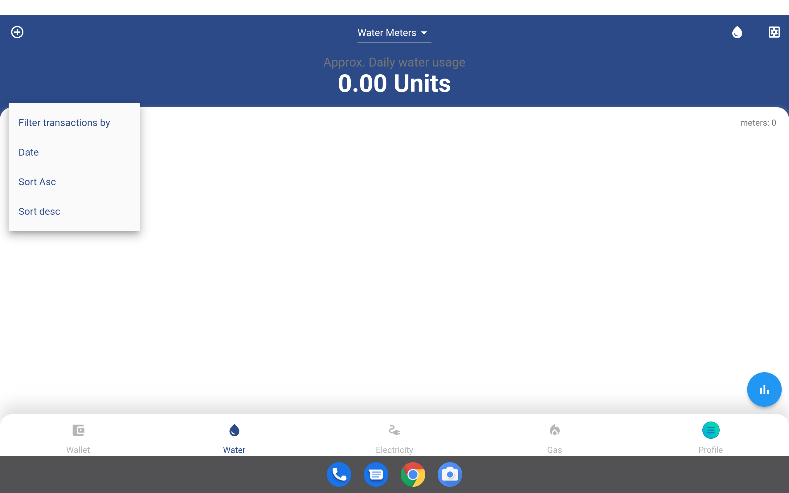

# Meter Management

## Meters

In the subsequent 3 screens we have Water, Electricity and Gas Meters. You can navigate between these screens using the bottom screen navigation. We will describe all the screens since their functionality is similar and easy to to use it.
The screens are used to track each utility as the name suggests. User can add new meter to track and the meters are listed on each screen. The listed meters are held in expandable component that show a recent bill payment transaction only related to the expanded meter.
User can also view on the reports for the meters added.

### Features of meters

1. Register a meter
2. Refresh Meter
3. Show Readings History
4. Filter Meters
5. Show Report

## Register Meter

This screen enable user to register their utility meter using Meter Number and the last MPESA transaction code. This setup assumes the user has been issued with our meters and its active and working. The Meter Number is unique for each Meter. 

|  |
| :----------------------------------------------------------: |

Tap on the button at the top header the one on left side. This action open a form with two input fields to fill in. 

Enter the meter number and the last MPESA transaction code used to pay or recharge the meter.

Tap on the `Register` button and a request will be sent to Enerlytics servers to verify the input. If the Meter No matches any of our registered meters and we can check the MPESA transaction code is correct we can confirm you own and operates the meter. Meter will be added to you profile and no one else can monitor this meter. You will now be able to track the meter.

In case any of the input information is invalid user will receive a response error message indicating why the registration failed. You can rectify any error and in case the error persist you can contact us for further assistance.

|  |
| :----------------------------------------------------------: |

Registered meters are not shared with other users. You can monitor the meter on many devices you have logged in with your account credentials.

## Refresh Meters

The App automatically fetches the meters owned by the logged in users. When user registers  a new Meter the new meter and its transaction history are loaded from server and displayed on the list of meters. In case the user wish to manually refresh the meters, you can tap on the refresh icon button on the right side of the header. This can be effective is users switches the Internet connection or if they notice the data is stale. User can also refresh or fetch more data transactions history of a meter by expanding the specific meter widget then scroll through the listed transaction. To fetch more tap on more link and the data more will be fetched. 

|  |  |
| :----------------------------------------------------------: | :----------------------------------------------------------: |

## Displaying Readings

The vital reading to monitor include:- Current Meter reading, Previous Meter reading and average meter usage. 

|  |
| :----------------------------------------------------------: |

#### Definition and Calculations

##### Current Reading 

This the amount of units last amount recharged for the meter. It is displayed on the meter widget. It is easy to see for each meter listed. It also includes the  date it was recharged.

##### Previous Reading 

This are a list recharges overtime arranged in descending order. The previous reading are shown when you expand the meter widget by tapping on the right expand icon button. It shows a list of recharges and the date it was recharged.

##### Average Reading 

This is the estimated household consumption per day. The  average meter reading is shown at the top header. User can filter using meter to check the average reading of a specific meter or a combination of meters.

## Filter Meter Readings

The user can track transactions even those made before the meter was registered. It allows filtering these transaction by date range, days of the week, weeks of a month, or each month in an year. This is effective to check overall usage and monitor previous readings. To filter just select the drop down menu below the top header on the left side. Pick any filtering option and data will be refreshed automatically. You can also select specific dates to fetch by using date picker at the top header, right side.

|  |
| :----------------------------------------------------------: |

