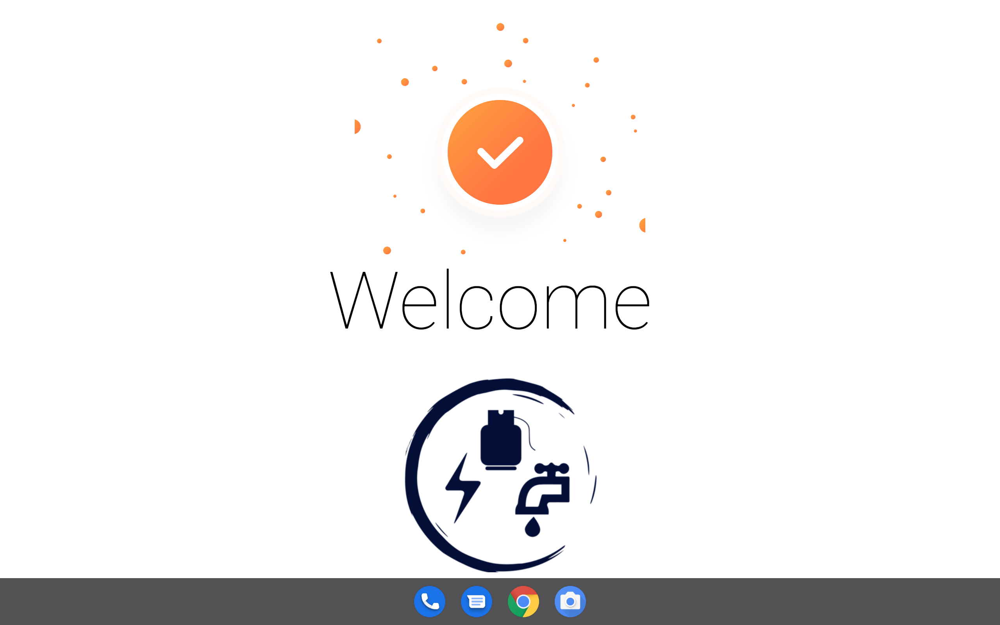

## On-boarding Users

The first welcome screen is the on-boarding screens. This the main entry to enerlytics app for new users. It is displayed on each first or new install. 
It describes the main features of the app, using a graphic image and text description below the image. This serves the purpose of brief introduction that should 
guide the user step by step to welcome the user. 

|  |
| ------------------------------------------------------------ |

There are two buttons at the bottom of the on-boarding screens that are meant for navigation.
The left button when tapped allows the user to skip the orientation and leads the user to the last on-board screen. It was 
added for quick navigation if user has already been oriented. The last on-board screen has a single button containing text done 
to finalize the on-boarding and  direct user to register screen. The Other screen have a right button that navigates the user 
forward along the four screens. The content in these screens is self explanatory and are designed to catch user attention.
The images and text content is static and is contained in the executable application. The content can only be changed in a new app version.

## Welcome page

The welcome page serves as the splash page. It shows every time a user loads the app. The welcome page is entry screen for 
users who have been authenticated. It was designed to show the app logo, welcome message with name of the logged in user, and 
biometric widget. The main purpose of welcome screen is to authenticate previously logged in user by requesting and refreshing authentication 
token. This token is encrypted and securely stored for any subsequent API request. Only authentic token can communicate to the server
to exchange data. The welcome page allows the user to lock the app using biometric fingerprint and ensure only data privacy.
This screen is essential as it acts as the gate keeper to establish an authentic session before using the app. User can decide if the can enable or disable biometric authentication in the settings. This screen cannot be customized by user but it has feedback message
to alert user on the background processes. To learn more about check the system design page.

|  |
| -------------------------------------------------- |

