# Technical documentation for Developers

To update source code using system design diagrams, a mobile developer should follow these steps:

1. Review the current system design diagrams to understand the overall architecture and flow of the system. This will help the developer identify which components of the system will be affected by the code update.

2. Identify the specific source code files that need to be updated. The developer can use the system design diagrams to trace the flow of data and control through the system and determine which files are responsible for the functionality that needs to be modified.

3. Make a copy of the source code files that will be updated. This will allow the developer to test the changes without affecting the live system.

4. Make the necessary changes to the source code files. The developer should ensure that the changes are well-documented and that the code is clean and easy to read.

5. Test the updated source code using the copied files. The developer should ensure that the changes have the desired effect and do not introduce any new errors or issues.

6. If the updated source code passes the tests, the developer can then merge the changes into the live system. It is generally a good idea to perform this update during a period of low usage or to roll out the update gradually to minimize the impact on users.

7. Once the update has been merged into the live system, the developer should review the system design diagrams again to ensure that the updated code fits into the overall architecture and flow of the system as intended.

   ### System Diagrams

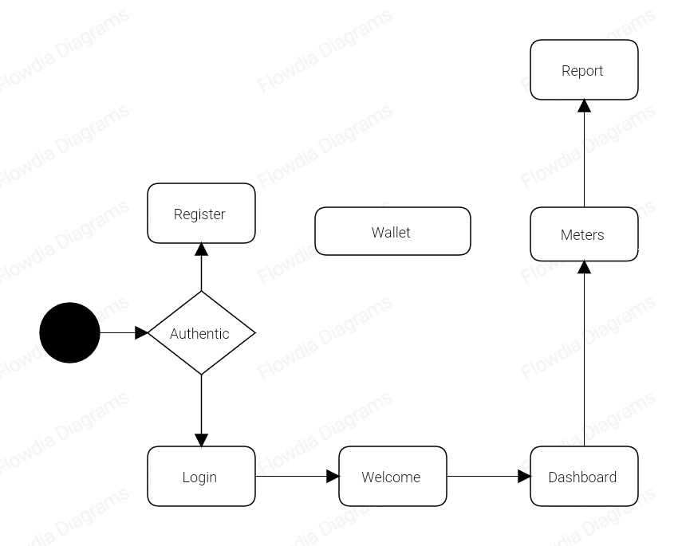

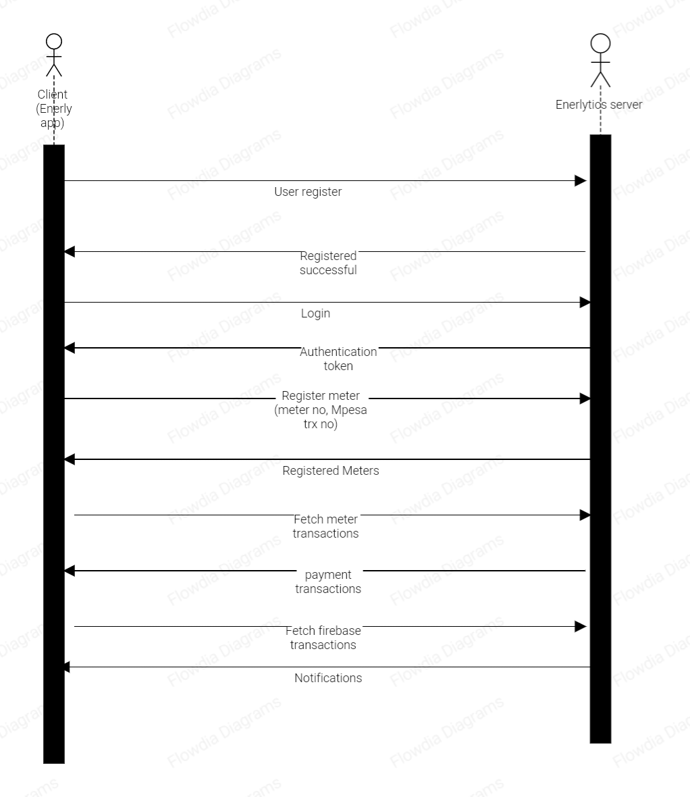

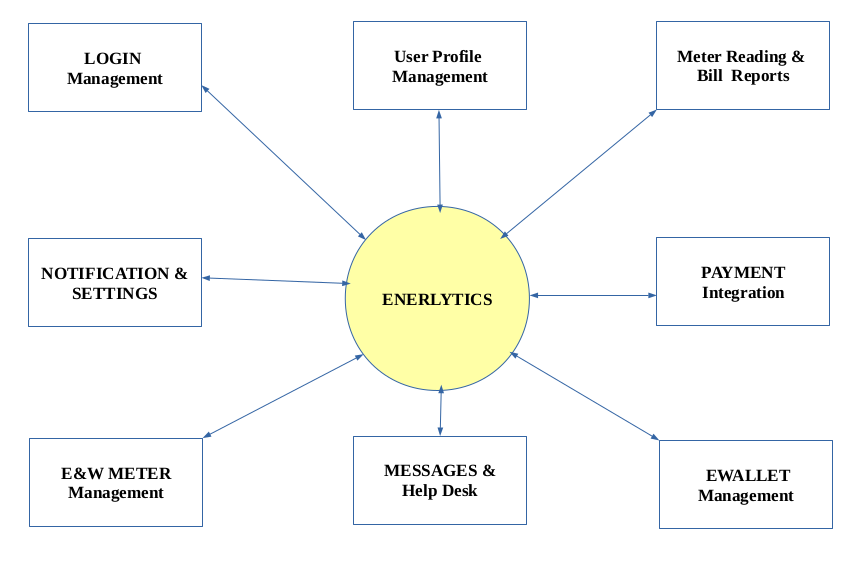

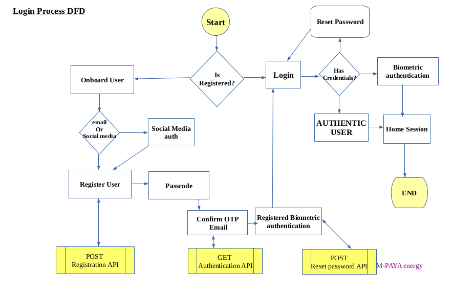

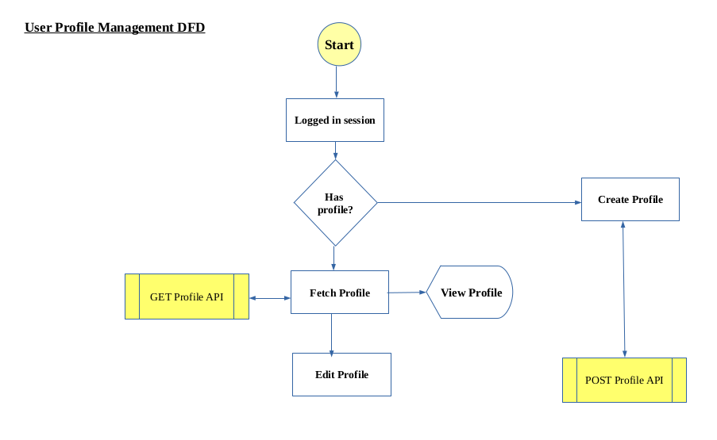

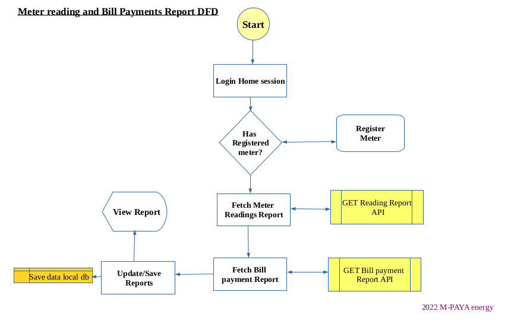

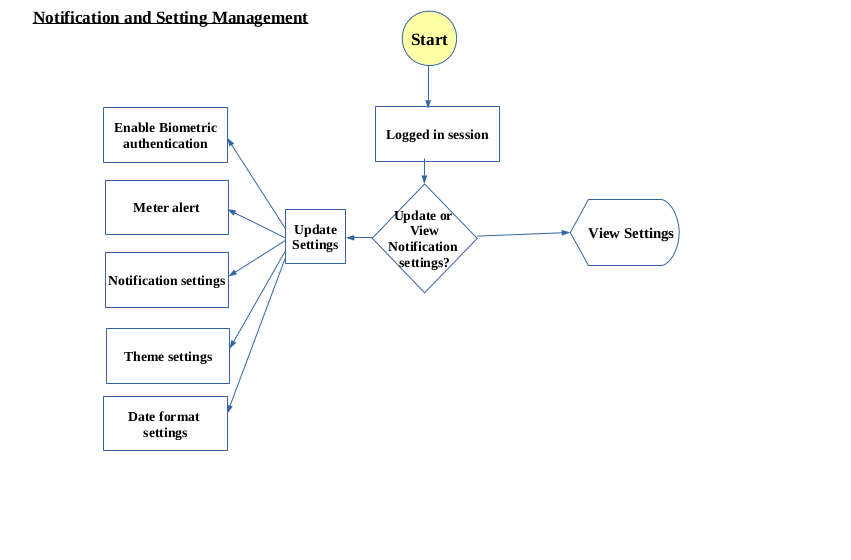

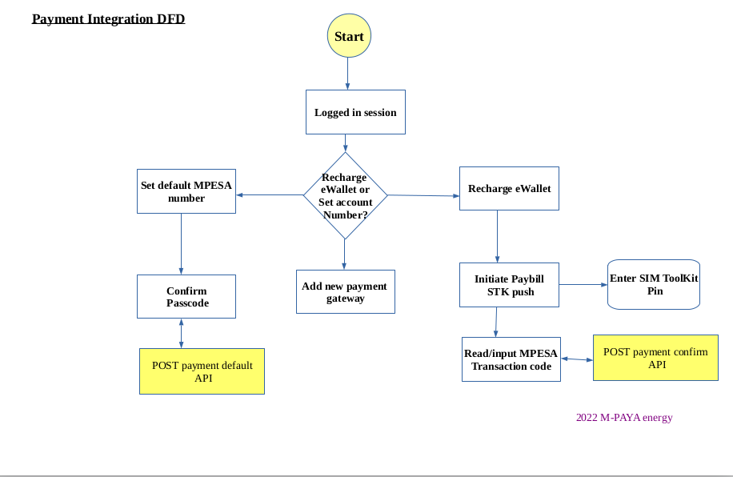

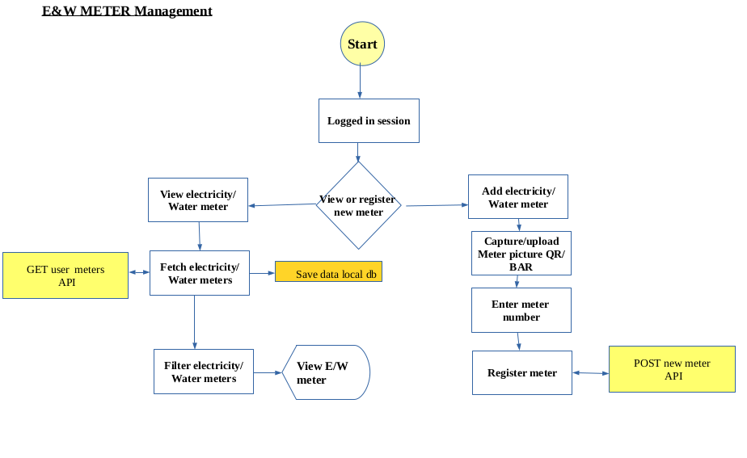

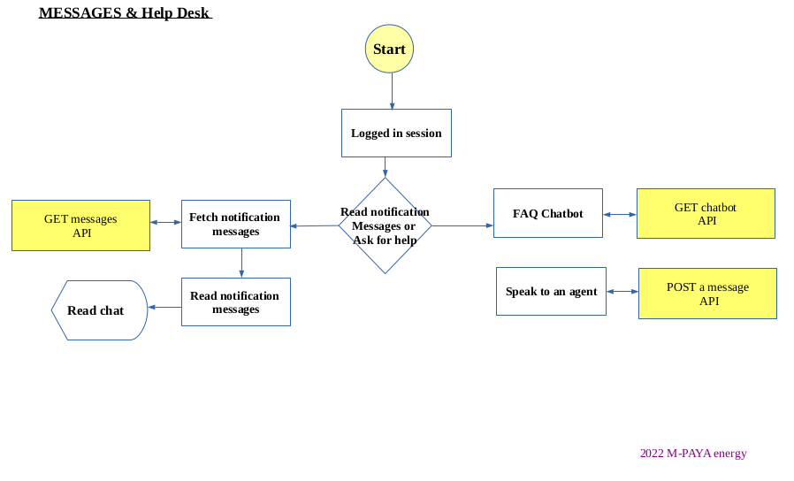

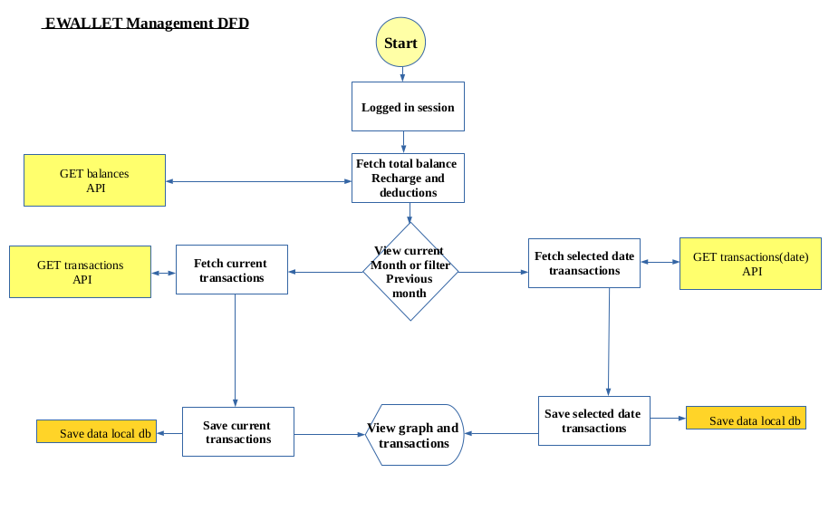

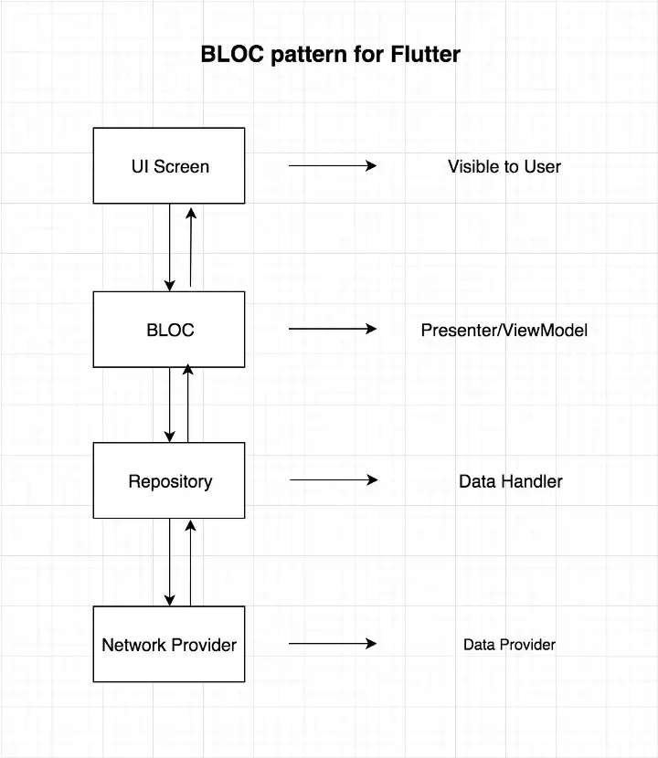
